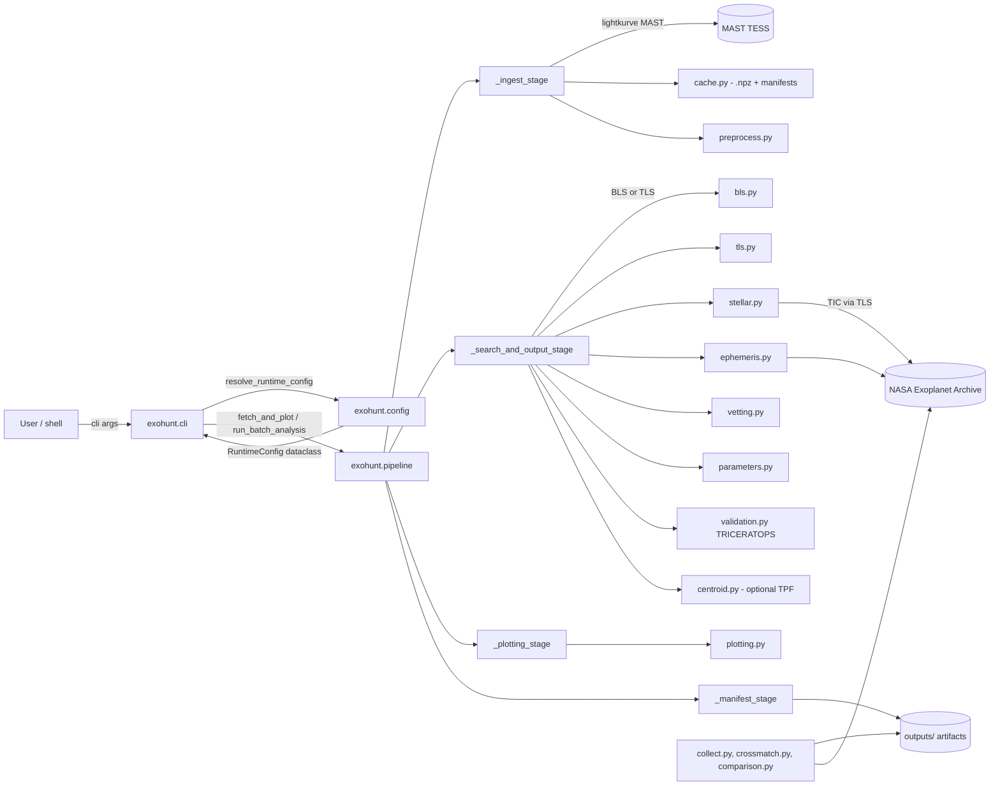
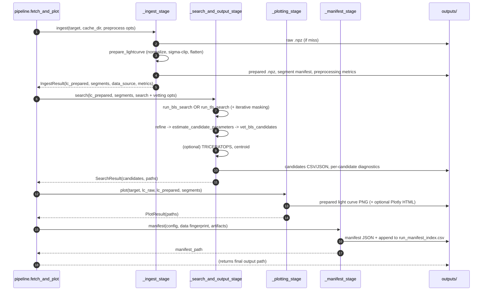
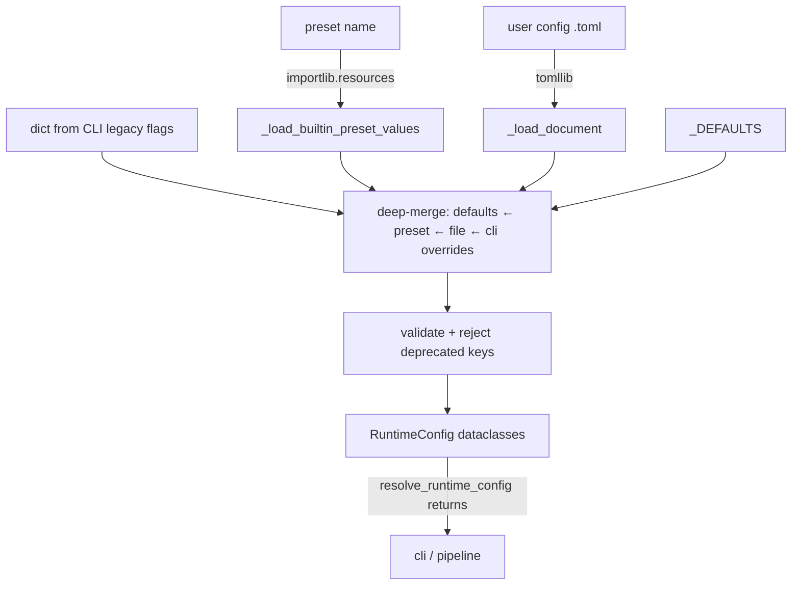
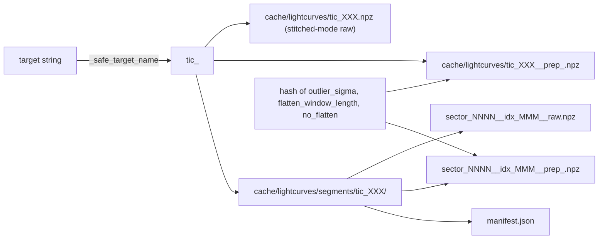

# Architecture — Exohunt

## Architectural style

Exohunt is a single-process, stage-oriented Python pipeline with a strict separation between:

1. **Config resolution** (`exohunt.config`) — pure, declarative, deterministic.
2. **Orchestration** (`exohunt.pipeline`) — stateful, side-effectful, composes staged helpers and writes artifacts.
3. **Domain modules** — focused libraries consumed by the pipeline (`bls`, `tls`, `preprocess`, `vetting`, `validation`, `centroid`, `plotting`, `parameters`, `stellar`, `ephemeris`, `cache`, `ingest`, `models`).
4. **CLI veneer** (`exohunt.cli`) — argparse wrapper that resolves a config, then calls `fetch_and_plot` or `run_batch_analysis`.
5. **Aggregation / post-processing** (`collect`, `crossmatch`, `comparison`) — independent tools that read the on-disk artifact tree and produce derived summaries.

There is no service layer, no database, no network server, no concurrency beyond a thread-pool timeout around blocking catalog queries. Persistence is the local filesystem under `outputs/`.

## High-level flow

## The five-stage per-target pipeline

`fetch_and_plot(target, ...)` resolves config choices into flags, validates the three independent "two-track" modes (preprocess, plot, BLS: `stitched` vs `per-sector`), and then drives four stages in order:

Note on stage labeling: the project documents this as a "5-stage" workflow — ingest, preprocess, search, vetting, plotting. In code, preprocess is performed inside `_ingest_stage` (alongside cache lookup and download) and vetting is performed inside `_search_and_output_stage` (alongside parameter estimation and candidate persistence). The manifest stage exists purely for reproducibility and is not part of the scientific narrative.

## Batch orchestration

`run_batch_analysis(targets, ...)` wraps `fetch_and_plot` per target with:

- **Resumable state**: reads/writes `outputs/batch/run_state.json` containing `completed_targets`, `failed_targets`, and `errors` keyed by target string. With `--resume`, completed targets are skipped and emit status `skipped_completed`.
- **Failure isolation**: one target's exception does not abort the batch. Errors are captured per target and written to `run_status.csv` plus a JSON sidecar.
- **Network retries**: transient `OSError`, `ConnectionError`, `TimeoutError` are retried up to 3 times with backoff.
- **Progress**: `progress._render_progress` writes carriage-return progress to stderr.
- **Live CSV append** (done inside `_search_and_output_stage`): `outputs/batch/candidates_live.csv` and `outputs/batch/candidates_novel.csv` are appended per-candidate as the batch runs, so results are observable before the batch completes.

## Configuration architecture

Key properties:

- **Schema versioned**: `schema_version = 1`. Writers embed it in every manifest.
- **Deprecated-key rejection**: known removed keys (`ingest.sectors`, `plot.time_start_btjd`, `plot.time_end_btjd`, `plot.sectors`, `cache_dir`, `max_download_files`) raise `ConfigValidationError` with a migration message instead of silently ignoring.
- **Legacy `global` mode**: `preprocess.mode = "global"` is accepted and remapped to `"stitched"` with a warning. Other two-track values (`plot.mode`, `bls.mode`) reject `global` outright.
- **Preset metadata**: built-in presets are hashed (`schema_version` + values + pack version) so manifests can record the exact preset version used.
- **Immutability**: every `*Config` dataclass is `frozen=True`.
- **Where validation lives**: `config.py` does schema and cross-field validation; `pipeline.py` does the final mode-value gatekeeping (`_resolve_preprocess_mode`, `_resolve_two_track_mode`).

## Reproducibility by design

Every run computes two content hashes and a derived comparison key:

- `config_hash` — 16-hex SHA-1 of the flat config payload passed to `fetch_and_plot`.
- `data_fingerprint_hash` — 16-hex SHA-1 of the raw/prepared data summary (point counts, time range, mode, data source).
- `comparison_key` — hash of `{target, config_hash, data_fingerprint_hash}`. Two runs with the same comparison key are directly comparable across time.
- `manifest_run_key` — hash of `{comparison_key, run_started_utc}`. Unique per run; used in manifest filenames.

Each run writes:

- `outputs/<target>/manifests/<slug>__manifest_<manifest_run_key>.json` containing runtime config, data summary, artifact list, software versions (`numpy`, `astropy`, `lightkurve`, `matplotlib`, `pandas`, `plotly`, plus `exohunt` itself), and platform fingerprint.
- A row appended to `outputs/manifests/run_manifest_index.csv` with timing, hashes, data/search mode, artifact counts, and the manifest file path.

## Caching architecture

- Raw cache is invariant under preprocessing settings and can be reused freely.
- Prepared cache key changes whenever preprocessing inputs change, so different configs don't collide.
- Both stitched and per-sector modes are supported and cached independently.
- `--no-cache` suppresses cache writes (but still reads if present), keeping disk usage low for long batches.

## Error handling and logging

- Top-level errors propagate out of `fetch_and_plot` as `RuntimeError`s (e.g. missing targets, bad mode values, no TESS products found, unreadable fluxes).
- Inside `run_batch_analysis`, exceptions are trapped per target, recorded in state and status, and the loop continues.
- Logging uses the standard `logging` module with module-level loggers. CLI configures `logging.basicConfig(level=INFO, format="%(message)s")` once in `main()`.
- Progress is rendered on stderr; log output and progress do not interleave awkwardly because progress is carriage-return based.

## External service boundaries

- **MAST via `lightkurve`**: light curve search/download (`lk.search_lightcurve`, `SearchResult.download_all`). TPFs via `lk.search_targetpixelfile`.
- **NASA Exoplanet Archive TAP** (`https://exoplanetarchive.ipac.caltech.edu/TAP/sync`): two independent consumers — `exohunt.ephemeris` (confirmed planets + TOI list for pre-masking) and `exohunt.crossmatch` (post-run NEW/KNOWN/HARMONIC labeling).
- **MAST TIC catalog** via `transitleastsquares.catalog_info` and `astroquery.mast.Catalogs` for stellar parameters and density.
- **TRILEGAL** (web service used internally by TRICERATOPS) — deliberately short-circuited in `validation.py` (`_tf.query_TRILEGAL = lambda *a, **kw: None`) because it is often unavailable; background false-positive scenarios are dropped gracefully when it is missing.

All network-bound queries are behind timeouts and fall back to safe defaults (solar stellar params, empty known-planet lists) so that offline/failed queries do not abort a batch.

## Extensibility hooks

- Add a new preset by dropping `.toml` into `src/exohunt/presets/`. It is auto-discovered by `list_builtin_presets()` via `importlib.resources`.
- Add a new search engine by returning `BLSCandidate` objects from a new module and dispatching on `bls.search_method` inside `_search_and_output_stage`. The existing TLS wrapper is the reference implementation of this pattern.
- Add a new vetting check by extending `vet_bls_candidates` to compute a new boolean and updating `CandidateVettingResult`, then including the column in `pipeline._CANDIDATE_COLUMNS`.
- Add a new consumer of the artifact tree by mirroring `collect.py` or `crossmatch.py`: glob `outputs/**/candidates/*.json`, operate in place, and write a new top-level summary.
