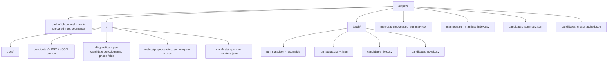

# Codebase Info — Exohunt

## Project identity

- Name: `exohunt` (repository directory: `exoplanets-hunting-pipeline`)
- Purpose: Ingest, preprocess, plot, and transit-search TESS (Transiting Exoplanet Survey Satellite) light curves to find and vet exoplanet candidates. The pipeline emphasizes reproducible, single-target and batch-resumable workflows with deterministic artifacts.
- Status: Experimental, evolving (`Status: experimental` badge in README).
- License: See `LICENSE` (local).
- Python: `>=3.10` (CI tests 3.10 and 3.11).

## Primary languages and tooling

- Language: Python only.
- Packaging: setuptools (`pyproject.toml`, `src/` layout, package discovery under `src/exohunt`).
- Lint: `ruff` (line length 100, target py310).
- Tests: `pytest` (tests in `tests/`).
- Pre-commit: `ruff` + `ruff-format`.
- CI: GitHub Actions (`.github/workflows/ci.yml`) runs `ruff check .` and `pytest -q` on 3.10 + 3.11.

## Top-level directory map

```mermaid
graph TD
    Root[exoplanets-hunting-pipeline/] --> Src[src/exohunt/]
    Root --> Tests[tests/]
    Root --> Configs[configs/]
    Root --> Examples[examples/]
    Root --> DocsDot[.docs/]
    Root --> Docs[docs/]
    Root --> Scripts[scripts/]
    Root --> Assets[assets/]
    Root --> Outputs[outputs/ - gitignored artifacts]
    Root --> Agents[.agents/summary/ - this documentation]
    Root --> Orchestrator[.ai-orchestrator/]
    Root --> GH[.github/workflows/]
    Root --> ReadmeEtc[README.md / LICENSE / pyproject.toml]

    Src --> Pipeline[pipeline.py - orchestration]
    Src --> CLI[cli.py - argparse entrypoint]
    Src --> Config[config.py - TOML schema]
    Src --> Presets[presets/ - builtin .toml]
    Src --> Search[bls.py + tls.py]
    Src --> Vet[vetting.py + validation.py + centroid.py]
    Src --> Io[ingest.py + cache.py + preprocess.py]
    Src --> Plot[plotting.py]
    Src --> Meta[parameters.py + ephemeris.py + stellar.py + models.py]
    Src --> Aggregate[collect.py + crossmatch.py + comparison.py]
    Src --> TUI[tui/ - compiled-only subpackage]
```

## Package layout

- `src/exohunt/` — single Python package shipped by the project. Every import uses absolute `exohunt.<module>` paths (no relative imports).
- `src/exohunt/presets/*.toml` — bundled runtime presets. Loaded via `importlib.resources`.
- `src/exohunt/tui/` — Terminal User Interface subpackage, currently present only as compiled `.pyc` bytecode under `__pycache__/` (no `.py` source in the tree). Not usable from source checkout.
- `tests/` — pytest test modules, plus `tests/fixtures/`.
- `configs/` — user-authored TOML configs (`iterative.toml`, `p0_validation.toml`).
- `examples/` — `config-example-full.toml` (fully commented schema reference), `output-example-candidates.json` (illustrative candidates file).
- `.docs/` — research manual and pre-built target lists (`targets_premium.txt`, `targets_standard.txt`, `targets_extended.txt`, `targets_iterative_search.txt`).
- `docs/` — free-form analysis notes (`next-steps-*.md`, `novel-candidates-analysis-*.md`).
- `scripts/` — one-off research / validation scripts (`m1_validate.py`, `m3_validate.py`, `m5_toi178.py`, `p0_validate.py`, `tls_*.py`, `debug_duration*.py`, `verify_duration.py`). Not part of the package API.
- `assets/screenshots/` — README images.
- `outputs/` — runtime artifact directory (light-curve cache, per-target analysis results, batch state, live CSVs, top-level summaries). Gitignored.
- `.ai-orchestrator/` — internal workflow/agent definitions (not part of the package, not loaded at runtime).
- `milestone-plan.md`, `config-concept.md` — project planning documents at repo root.

## Source module roster (`src/exohunt/`)

| Module | Role |
|---|---|
| `__init__.py` | Empty package marker. No re-exports. |
| `cli.py` | Argparse CLI. Entry module used via `python -m exohunt.cli {run,batch,init-config}`. Also supports a legacy flag-based form that maps into the runtime config with a deprecation warning. |
| `pipeline.py` | Core orchestration. Public entry points: `fetch_and_plot(...)` (single target) and `run_batch_analysis(...)` (batch, with resume and retries). Internally composed of staged helpers: `_ingest_stage`, `_search_and_output_stage`, `_plotting_stage`, `_manifest_stage`, plus batch state I/O. Writes manifests, metrics, candidate CSV/JSON, diagnostic plots. |
| `config.py` | Declarative runtime config. Dataclasses (`IOConfig`, `IngestConfig`, `PreprocessConfig`, `PlotConfig`, `BLSConfig`, `VettingConfig`, `ParameterConfig`, `RuntimeConfig`) plus loader/validator `resolve_runtime_config(...)`, preset discovery (`list_builtin_presets`, `get_builtin_preset_metadata`), and `write_preset_config(...)` used by `init-config`. Schema v1. Rejects deprecated keys with actionable messages. |
| `presets/*.toml` | Built-in presets: `quicklook`, `science-default`, `deep-search`, `iterative-search`. Loaded from package resources. |
| `models.py` | Shared dataclass(es): `LightCurveSegment` (segment_id, sector, author, cadence, `lk.LightCurve`). |
| `ingest.py` | Converts Lightkurve search results into `LightCurveSegment` lists. Author filter parsing. |
| `cache.py` | On-disk cache helpers for raw and preprocessed light curves. Uses hash keys derived from preprocessing parameters so cache entries are invariant under config changes. Also writes segment manifests. |
| `preprocess.py` | `prepare_lightcurve(...)`: NaN removal, median normalization, sigma-clip outlier removal, Lightkurve `flatten` detrending with mask support. `compute_preprocessing_quality_metrics(...)`: raw-vs-prepared RMS / MAD / trend-proxy / retention ratios. |
| `bls.py` | Box Least Squares wrapper over `astropy.timeseries.BoxLeastSquares`. `BLSCandidate` dataclass, `run_bls_search`, `compute_bls_periodogram`, `refine_bls_candidates`, `run_iterative_bls_search` (masks transit epochs of prior detections and re-runs BLS on the residual), `_build_transit_mask`, `_cross_iteration_unique`, optional bootstrap FAP. |
| `tls.py` | Transit Least Squares wrapper (`transitleastsquares`). Returns results as `BLSCandidate` for interface parity. Binning helper to reduce runtime, stellar-parameter injection, per-peak narrow refinement with BLS for duration. Sets multiprocessing `fork` start method on POSIX. |
| `stellar.py` | `query_stellar_params(tic_id)`: queries TIC via TLS `catalog_info` for R_star, M_star, and Claret limb-darkening coefficients with solar fallback. Thread-pool timeout. |
| `ephemeris.py` | NASA Exoplanet Archive TAP queries for known planets and TOI candidates around a TIC. Used for pre-masking known transits before searching. |
| `parameters.py` | First-pass candidate parameter estimates (Rp/Rs from depth, Earth-radius assuming solar R, expected central duration from stellar density, duration-ratio plausibility gate). Optional TIC density lookup via `astroquery.mast.Catalogs`. |
| `vetting.py` | `vet_bls_candidates(...)`: min-transit-count, odd/even depth mismatch (duty-cycle adjusted), alias/harmonic cross-check, secondary eclipse, depth consistency across data halves. Returns `CandidateVettingResult` per rank. |
| `validation.py` | TRICERATOPS Bayesian FPP / NFPP validation (`validate_candidate`). Patches out the TRILEGAL web service and gracefully drops background scenarios if unavailable. Thresholds: FPP<0.015 and NFPP<0.001 → validated (Giacalone & Dressing 2020). |
| `centroid.py` | Centroid-shift vetting using TESS Target Pixel Files. Compares in-transit vs out-of-transit flux-weighted centroids to catch nearby eclipsing-binary contamination. |
| `plotting.py` | Static and interactive (Plotly) light-curve plots, candidate diagnostic plots (periodogram, phase-fold). Min-max downsampling helper. |
| `cache.py` / `collect.py` / `crossmatch.py` / `comparison.py` | Aggregation and reporting utilities (see Interfaces). |
| `collect.py` | Runnable as `python -m exohunt.collect`. Scans `outputs/<target>/candidates/*.json` and produces `outputs/candidates_summary.json`. Filters: `--iterative-only`, `--all`. |
| `crossmatch.py` | Runnable as `python -m exohunt.crossmatch`. Labels candidates as `KNOWN`, `HARMONIC`, or `NEW` against NASA Exoplanet Archive via TAP. Writes `outputs/candidates_crossmatched.json`. |
| `comparison.py` | Runnable as `python -m exohunt.comparison`. Builds a markdown preprocessing-method comparison report from `outputs/metrics/preprocessing_summary.csv`. |
| `progress.py` | Tiny CLI progress renderer (stderr carriage return). |

## Executable entry points

- `python -m exohunt.cli run --target "TIC ..." --config <preset-or-path>`
- `python -m exohunt.cli batch --targets-file <path> --config <preset-or-path> [--resume] [--no-cache] [--state-path ...] [--status-path ...]`
- `python -m exohunt.cli init-config --from <preset> --out <path>`
- `python -m exohunt.cli ...legacy flags...` — legacy flat-flag form (deprecated, emits warning; `--preprocess-mode global` is mapped to `stitched`).
- `python -m exohunt.collect [--iterative-only|--all] [-o PATH]`
- `python -m exohunt.crossmatch [SUMMARY_PATH] [-o PATH]`
- `python -m exohunt.comparison [--metrics-csv ...] [--cache-dir ...] [--report-path ...]`

No console script is declared in `pyproject.toml`; invocation is always via `python -m exohunt.<module>`.

## Runtime outputs (filesystem contract)

- Target-directory names are a safe-slug of the target string: `"TIC 261136679"` → `tic_261136679`.
- Per-run filenames embed a 12–16 char hex hash derived from `{config, data_fingerprint}` for deterministic run-to-run comparison, plus a per-run "manifest run key" for uniqueness.
- `outputs/manifests/run_manifest_index.csv` is the append-only index across all runs and targets.

## CI / quality gates summary

- GitHub Actions `CI` workflow (`.github/workflows/ci.yml`): matrix on Python 3.10 and 3.11; installs `-e .[dev]`; runs `ruff check .` and `pytest -q`.
- Pre-commit hooks (`.pre-commit-config.yaml`): `ruff` and `ruff-format` (pin `v0.6.9`).
- `pyproject.toml` `[tool.ruff]`: `line-length = 100`, `target-version = "py310"`.
- `pyproject.toml` `[tool.pytest.ini_options]`: `testpaths = ["tests"]`.
