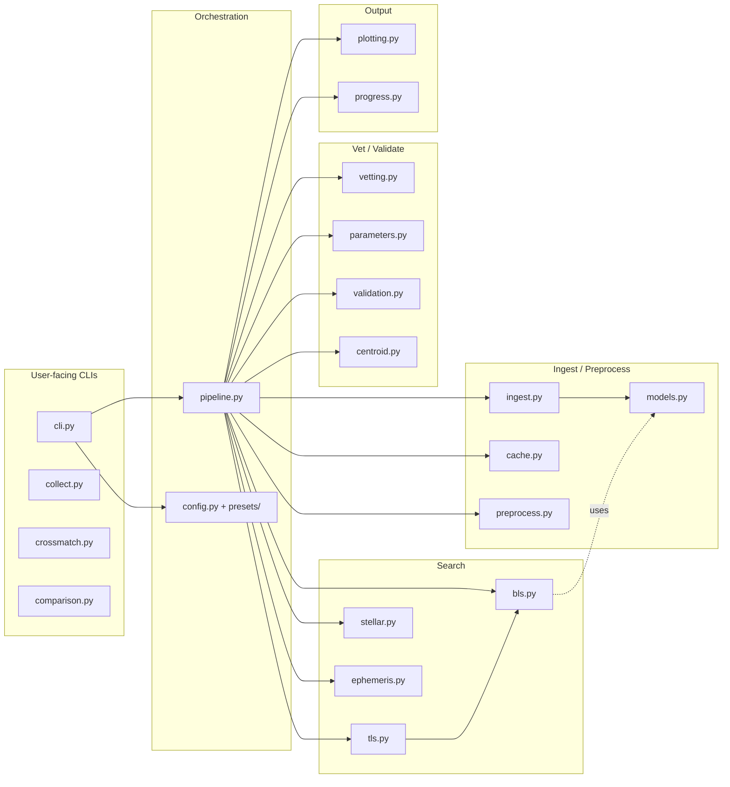

# Components — Exohunt

This document describes each first-class component of the `exohunt` package and the user-facing CLI / module tools around it.

## Component map

## CLI / orchestration components

### `exohunt.cli` — argparse front door

- **Responsibilities**: parse user arguments; resolve a `RuntimeConfig` via `_resolve_runtime`; call `fetch_and_plot` or `run_batch_analysis`; expose `init-config` to export built-in presets to TOML on disk.
- **Subcommands**: `run`, `batch`, `init-config`. Additional legacy flat-flag form goes through `_run_legacy` which still builds a `cli_overrides` dict and takes the same preset/config path.
- **Key functions**: `main(argv)`, `build_parser`, `build_legacy_parser`, `_resolve_runtime`, `_resolve_config_reference`, `_run_single_target`, `_run_batch_targets`, `_load_batch_targets`.
- **Signaled errors**: `RuntimeError` on empty `--config`, invalid mode, empty batch file, config validation failure.

### `exohunt.pipeline` — orchestration and artifact I/O

- **Public entry points**: `fetch_and_plot(target, **kwargs) -> Path | None` and `run_batch_analysis(targets, **kwargs) -> tuple[Path, Path, Path]`.
- **Staged internals**: `_ingest_stage`, `_search_and_output_stage`, `_plotting_stage`, `_manifest_stage`. Each returns a frozen dataclass (`IngestResult`, `SearchResult`, `PlotResult`).
- **Column schemas owned here**:
  - `_PREPROCESSING_SUMMARY_COLUMNS` (preprocessing metrics CSV)
  - `_CANDIDATE_COLUMNS` (candidate table — fields tracked from BLS → parameters → vetting)
  - `_MANIFEST_INDEX_COLUMNS` (top-level `run_manifest_index.csv`)
  - `_BATCH_STATUS_COLUMNS` (batch `run_status.csv`)
- **Batch state helpers**: `_default_batch_state_path`, `_default_batch_status_path`, `_load_batch_state`, `_save_batch_state`, `_write_batch_status_report`.
- **Manifest helpers**: `_hash_payload`, `_runtime_version_map`, `_write_run_manifest`, `_write_manifest_index_row`, `_candidate_output_key`.
- **Mode normalization**: `_resolve_preprocess_mode` (accepts legacy `global`), `_resolve_two_track_mode` (strict).
- **Metrics caching**: `_metrics_cache_path`, `_load_cached_metrics`, `_save_cached_metrics`, `_write_preprocessing_metrics`.
- **Live-candidate append**: `_append_live_candidates` (writes `outputs/batch/candidates_live.csv` and `candidates_novel.csv`).

### `exohunt.config` — declarative runtime configuration

- **Dataclasses** (all frozen): `IOConfig`, `IngestConfig`, `PreprocessConfig`, `PlotConfig`, `BLSConfig`, `VettingConfig`, `ParameterConfig`, `RuntimeConfig`.
- **Public API**: `resolve_runtime_config(config_path=None, preset_name=None, cli_overrides=None)`, `list_builtin_presets()`, `get_builtin_preset_metadata(name)`, `write_preset_config(preset_name, out_path)`.
- **Internals**: `_DEFAULTS` (baseline values), `_DEPRECATED_KEY_MESSAGES` (removal migration text), `_load_builtin_preset_documents`, `_load_builtin_preset_values`, `_stable_hash`.
- **Error type**: `ConfigValidationError(ValueError)`.

### `exohunt.presets/` — bundled configs

- `quicklook.toml` — short period range, BLS only, no iterative masking, fast.
- `science-default.toml` — balanced baseline; this is the default `--config`.
- `deep-search.toml` — TLS, iterative (3 passes), wider period range (up to 40d), TIC density lookup, interactive HTML plots.
- `iterative-search.toml` — TLS, iterative (3 passes), period range to 25d; optimized for systematic multi-target planet hunting.

## Ingest / preprocess components

### `exohunt.ingest`

- **Role**: turn a Lightkurve `LightCurveCollection` into a list of `LightCurveSegment`s, applying author filter and `remove_nans`.
- **Functions**: `_parse_authors(str|None) -> set[str]|None`, `_build_segment_id(idx, lc)`, `_extract_segments(lcs, selected_authors)`.
- **Segment id format**: `sector_<4-digit sector>__idx_<3-digit index>`.

### `exohunt.cache`

- **Role**: on-disk cache paths, load/save, segment manifests. All cache paths are derived from `_safe_target_name(target)` plus a parameter-hash for prepared data so unrelated configs do not collide.
- **Key paths** (rooted at `cache_dir`, default `outputs/cache/lightcurves`):
  - Raw stitched: `<slug>.npz`
  - Prepared stitched: `<slug>__prep_<hashkey>.npz`
  - Segment base: `segments/<slug>/`
  - Segment raw: `segments/<slug>/<segment_id>__raw.npz`
  - Segment prepared: `segments/<slug>/<segment_id>__prep_<hashkey>.npz`
  - Segment manifest: `segments/<slug>/manifest.json`
- **Functions**: `_safe_target_name`, `_target_output_dir`, `_target_artifact_dir`, `_cache_path`, `_prepared_cache_key`, `_prepared_cache_path`, `_segment_*`, `_load_npz_lightcurve`, `_save_npz_lightcurve`, `_write_segment_manifest`, `_load_segment_manifest`.

### `exohunt.preprocess`

- **Role**: produce a `(lk.LightCurve, normalized_bool)` tuple from raw input via NaN removal, robust median normalization, sigma-clip outlier removal, and Lightkurve `flatten()` detrending with optional transit mask. Compute quality metrics for reporting.
- **Public functions**: `prepare_lightcurve(...)`, `compute_preprocessing_quality_metrics(lc_raw, lc_prepared)`.
- **Quality dataclass**: `PreprocessingQualityMetrics(n_points_raw, n_points_prepared, retained_cadence_fraction, raw_rms, prepared_rms, raw_mad, prepared_mad, raw_trend_proxy, prepared_trend_proxy, rms_improvement_ratio, mad_improvement_ratio, trend_improvement_ratio)`.
- **Robustness**: window length adapts to data size and optionally to `max_transit_duration_hours` (adaptive flatten). Skips flatten gracefully when not enough points.

### `exohunt.models`

- **Role**: shared dataclasses. Single entry today: `LightCurveSegment(segment_id, sector, author, cadence, lc)` (frozen).

## Search components

### `exohunt.bls`

- **Role**: BLS transit search over a period/duration grid using `astropy.timeseries.BoxLeastSquares`. Supports iterative masking to find multi-planet systems.
- **Public types and functions**:
  - `BLSCandidate(rank, period_days, duration_hours, depth, depth_ppm, power, transit_time, transit_count_estimate, snr, fap, iteration)` — the canonical "candidate" record for the whole pipeline (TLS and BLS both return these).
  - `run_bls_search(lc_prepared, ...) -> list[BLSCandidate]` — one-pass BLS.
  - `run_iterative_bls_search(...)` — runs BLS repeatedly, masking prior transit epochs each pass until `min_snr` fails or `iterative_passes` is reached.
  - `compute_bls_periodogram(...)` — returns `(periods, power)` for diagnostic plots.
  - `refine_bls_candidates(...)` — local dense re-search around each candidate.
  - `_build_transit_mask(...)`, `_cross_iteration_unique(...)` — mask construction and duplicate-period suppression across iterations.
  - `_bootstrap_fap(...)` — shuffling-based false-alarm probability.

### `exohunt.tls`

- **Role**: TLS (`transitleastsquares`) wrapper that returns `BLSCandidate` objects for interface parity. Bins the light curve to ~10 minutes to control runtime, runs a single wide TLS pass, then performs narrow TLS refinements around each unique SDE peak. For each peak, a BLS fit at the fixed period is used to get a reliable duration, depth, and `transit_time` (TLS duration can be unstable).
- **POSIX note**: sets multiprocessing start method to `fork` to avoid macOS issues.
- **Public function**: `run_tls_search(lc_prepared, period_min_days, period_max_days, top_n, min_sde, bin_minutes, unique_period_separation_fraction, stellar_params) -> list[BLSCandidate]`.

### `exohunt.stellar`

- **Role**: query stellar parameters for TLS. Returns `StellarParams(R_star, R_star_min, R_star_max, M_star, M_star_min, M_star_max, limb_darkening, used_defaults)`.
- **Strategy**: uses `transitleastsquares.catalog_info(TIC_ID=...)` which hits TIC and Claret tables; wraps in a `ThreadPoolExecutor` with a 30s timeout. Solar defaults (`R=1, M=1, u=(0.4804, 0.1867)`) on any failure.

### `exohunt.ephemeris`

- **Role**: query NASA Exoplanet Archive TAP for known planets and TOI candidates around a TIC. The pipeline pre-masks known transits so the first search pass is sensitive to new signals rather than re-finding the known planet.
- **Dataclass**: `KnownPlanetEphemeris(name, period_days, t0_bjd, duration_hours, rp_rs, a_rs, impact_param, confirmed)`.
- **Public functions**: `query_known_ephemerides(tic_id)`, `query_toi_ephemerides(tic_id)`, `query_all_ephemerides(tic_id)` (dedupes TOIs already matching confirmed planets within 3%).
- **Transport**: `_tap_query(query, timeout, retries=3)` with exponential backoff.

## Vetting / validation components

### `exohunt.vetting`

- **Role**: apply five automated false-positive filters to BLS/TLS candidates.
- **Checks**:
  1. `pass_min_transit_count` — observed in-transit cadences across >= N integer epochs.
  2. `pass_odd_even_depth` — depth mismatch between odd and even transits (duty-cycle adjusted; inconclusive when too few parity transits).
  3. `pass_alias_harmonic` — period matches a simple-ratio harmonic of a higher-power candidate (0.5x, 2x, 1/3x, 3x, 1/4x, 4x, 1/5x, 5x).
  4. `pass_secondary_eclipse` — fraction of primary depth observed at phase 0.5.
  5. `pass_depth_consistency` — depth agreement between first and second halves of the time series.
- **Returned type**: `CandidateVettingResult(pass_min_transit_count, pass_odd_even_depth, pass_alias_harmonic, vetting_pass, transit_count_observed, odd_depth_ppm, even_depth_ppm, odd_even_depth_mismatch_fraction, alias_harmonic_with_rank, vetting_reasons, odd_even_status, pass_secondary_eclipse, secondary_eclipse_depth_fraction, pass_depth_consistency, depth_consistency_fraction)`.
- **Public function**: `vet_bls_candidates(lc_prepared, candidates, min_transit_count, odd_even_mismatch_max_fraction, alias_tolerance_fraction, secondary_eclipse_max_fraction, depth_consistency_max_fraction) -> dict[rank, CandidateVettingResult]`.

### `exohunt.parameters`

- **Role**: first-pass astrophysical parameter estimates from BLS depth and duration.
- **Outputs** (`CandidateParameterEstimate`): `radius_ratio_rp_over_rs`, `radius_earth_radii_solar_assumption`, `duration_expected_hours_central_solar_density`, `duration_ratio_observed_to_expected`, `pass_duration_plausibility`, `parameter_assumptions`, `parameter_uncertainty_caveats`.
- **Optional**: TIC-density lookup via `astroquery.mast.Catalogs` (gated by `parameters.tic_density_lookup`), thread-pool timeout 10s.
- **Optional**: limb-darkening correction to the depth → `(Rp/Rs)^2` mapping via `(u1, u2)`.

### `exohunt.validation`

- **Role**: TRICERATOPS Bayesian false-positive probability. Computes FPP and NFPP for a single candidate; returns `ValidationResult(fpp, nfpp, validated, status)` where status is `validated` / `ambiguous` / `false_positive` / `error`.
- **Thresholds** (module constants): `_FPP_THRESHOLD = 0.015`, `_NFPP_THRESHOLD = 0.001` (Giacalone & Dressing 2020).
- **Robustness**: silently patches out the TRILEGAL web service, drops all background scenarios (`DTP, DEB, DEBx2P, BTP, BEB, BEBx2P`) when TRILEGAL data is unavailable, and returns `error` status with NaN probabilities on exceptions. Only runs when `vetting.triceratops_enabled = true`.

### `exohunt.centroid`

- **Role**: centroid-shift vetting. Uses a TESS Target Pixel File (TPF) to compare flux-weighted centroids between in-transit and out-of-transit cadences. A shift greater than `_DEFAULT_MAX_SHIFT_PIXELS = 0.1` px (~2.1 arcsec) flags nearby-binary contamination.
- **Functions**: `check_centroid_shift(tpf, period_days, transit_time, duration_hours, max_shift_pixels)`, `run_centroid_vetting(tic_id, candidates, tpf=None)`. Downloads the first matching SPOC TPF via Lightkurve if none is passed.
- **Status outcomes**: `pass`, `fail`, `inconclusive` (with reason: `centroid_estimation_failed`, `too_few_points`, `insufficient_transit_coverage`, `no_tpf`, `tpf_download_failed`).

## Output components

### `exohunt.plotting`

- **Role**: PNG and optional Plotly HTML plot generation for prepared light curves and candidate diagnostics.
- **Functions**:
  - `save_raw_vs_prepared_plot(target, lc_raw, lc_prepared, boundaries, output_key, smoothing_window)` — single-panel prepared light curve (ppm) with density shading and binned medians.
  - `save_raw_vs_prepared_plot_interactive(...)` — Plotly HTML (downsampled via `_downsample_minmax`).
  - `save_candidate_diagnostics(...)` — per-candidate periodogram + phase-folded plot.
  - `_downsample_minmax(time, flux, max_points)` — min/max bucket downsampling preserving transit dips.

### `exohunt.progress`

- **Role**: `_render_progress(prefix, current, total)` writes carriage-return progress to stderr. Intentionally tiny and has no external dependencies.

## Aggregation / reporting components

### `exohunt.collect`

- **Role**: post-run aggregator. Scans `outputs/<target>/candidates/*__bls_*.json` and produces `outputs/candidates_summary.json` with per-target candidate lists sorted by iteration then SNR.
- **Public function**: `collect_passed_candidates(outputs_dir, iterative_only, passed_only) -> dict`.
- **CLI**: `python -m exohunt.collect [--iterative-only] [--all] [-o PATH]` (default output `outputs/candidates_summary.json`).

### `exohunt.crossmatch`

- **Role**: label candidates `KNOWN` / `HARMONIC` / `NEW` vs NASA Exoplanet Archive confirmed planets. Queries `ps` table per TIC and checks period match within 3% and harmonics (0.5x, 2x, 1/3x, 3x, 2/3x, 3/2x).
- **Public function**: `crossmatch(summary_path, output_path=None) -> dict`.
- **CLI**: `python -m exohunt.crossmatch [SUMMARY] [-o PATH]` (defaults to `outputs/candidates_summary.json` → `outputs/candidates_crossmatched.json`).
- **Rate-limited**: sleeps 0.3s between TIC queries.

### `exohunt.comparison`

- **Role**: build a markdown comparison report of preprocessing configurations from `outputs/metrics/preprocessing_summary.csv`, grouping runs by cadence class and sector-span class, scoring by combined log-improvement in RMS/MAD/trend with a retention penalty.
- **Public function**: `build_preprocessing_comparison_report(metrics_csv_path, cache_dir, report_path) -> Path`.
- **CLI**: `python -m exohunt.comparison [--metrics-csv ...] [--cache-dir ...] [--report-path ...]`.

## Repository-level tooling

- **Scripts directory** (`scripts/`): ad-hoc validation / debug scripts intentionally outside the package. Safe to ignore when understanding the public API.
- **Target lists** (`.docs/targets_*.txt`): pre-built single-TOI systems sorted by sector count, used with `cli batch --targets-file`.
- **Research manual** (`.docs/research_manual.md`): step-by-step human workflow for running a systematic planet search. Reference for "what to do when".
- **Config examples** (`examples/config-example-full.toml`): fully commented schema reference. `examples/output-example-candidates.json`: illustrative candidate JSON file.
- **TUI subpackage** (`src/exohunt/tui/`): compiled-only today (`__pycache__` has `app`, `widgets`, `models`, `bridge`, `runner`, `screens.pyc`). Not usable from a source checkout and not on the current CLI entry paths; treat as effectively inactive unless `.py` sources are restored.
