# Data Models — Exohunt

All first-class in-memory structures and on-disk record schemas. Every Python dataclass below is `@dataclass(frozen=True)` unless otherwise noted.

## Relationships

```mermaid
classDiagram
    class RuntimeConfig {
        +int schema_version
        +str preset
        +IOConfig io
        +IngestConfig ingest
        +PreprocessConfig preprocess
        +PlotConfig plot
        +BLSConfig bls
        +VettingConfig vetting
        +ParameterConfig parameters
    }
    class IOConfig { +bool refresh_cache }
    class IngestConfig { +tuple authors }
    class PreprocessConfig
    class PlotConfig
    class BLSConfig
    class VettingConfig
    class ParameterConfig
    RuntimeConfig --> IOConfig
    RuntimeConfig --> IngestConfig
    RuntimeConfig --> PreprocessConfig
    RuntimeConfig --> PlotConfig
    RuntimeConfig --> BLSConfig
    RuntimeConfig --> VettingConfig
    RuntimeConfig --> ParameterConfig

    class LightCurveSegment {
        +str segment_id
        +int sector
        +str author
        +float cadence
        +LightCurve lc
    }

    class BLSCandidate {
        +int rank
        +float period_days
        +float duration_hours
        +float depth
        +float depth_ppm
        +float power
        +float transit_time
        +float transit_count_estimate
        +float snr
        +float fap
        +int iteration
    }

    class CandidateVettingResult {
        +bool pass_min_transit_count
        +bool pass_odd_even_depth
        +bool pass_alias_harmonic
        +bool pass_secondary_eclipse
        +bool pass_depth_consistency
        +bool vetting_pass
        +int transit_count_observed
        +float odd_depth_ppm
        +float even_depth_ppm
        +float odd_even_depth_mismatch_fraction
        +float secondary_eclipse_depth_fraction
        +float depth_consistency_fraction
        +int alias_harmonic_with_rank
        +str vetting_reasons
        +str odd_even_status
    }

    class CandidateParameterEstimate {
        +float radius_ratio_rp_over_rs
        +float radius_earth_radii_solar_assumption
        +float duration_expected_hours_central_solar_density
        +float duration_ratio_observed_to_expected
        +bool pass_duration_plausibility
        +str parameter_assumptions
        +str parameter_uncertainty_caveats
    }

    class ValidationResult {
        +float fpp
        +float nfpp
        +bool validated
        +str status
    }

    class CentroidResult {
        +float shift_col_pixels
        +float shift_row_pixels
        +float shift_total_pixels
        +float shift_total_arcsec
        +int n_in_transit
        +int n_out_transit
        +bool passed
        +str status
    }

    class StellarParams {
        +float R_star
        +float R_star_min
        +float R_star_max
        +float M_star
        +float M_star_min
        +float M_star_max
        +tuple limb_darkening
        +bool used_defaults
    }

    class KnownPlanetEphemeris {
        +str name
        +float period_days
        +float t0_bjd
        +float duration_hours
        +float rp_rs
        +float a_rs
        +float impact_param
        +bool confirmed
    }

    class PreprocessingQualityMetrics {
        +int n_points_raw
        +int n_points_prepared
        +float retained_cadence_fraction
        +float raw_rms
        +float prepared_rms
        +float raw_mad
        +float prepared_mad
        +float raw_trend_proxy
        +float prepared_trend_proxy
        +float rms_improvement_ratio
        +float mad_improvement_ratio
        +float trend_improvement_ratio
    }

    class BatchTargetStatus {
        +str run_utc
        +str target
        +str status
        +str error
        +float runtime_seconds
        +str output_path
    }

    BLSCandidate <.. CandidateVettingResult : vetted by rank
    BLSCandidate <.. CandidateParameterEstimate : parameterized by rank
```



## Config dataclasses (`exohunt.config`)

All fields required; defaults live in `_DEFAULTS`. See `interfaces.md` §3.2 for concrete value ranges.

- `IOConfig(refresh_cache: bool)`
- `IngestConfig(authors: tuple[str, ...])` — strings are normalized to uppercase.
- `PreprocessConfig(enabled, mode, outlier_sigma, flatten_window_length, flatten, iterative_flatten, transit_mask_padding_factor)`
- `PlotConfig(enabled, mode, interactive_html, interactive_max_points, smoothing_window)`
- `BLSConfig(enabled, mode, search_method, period_min_days, period_max_days, duration_min_hours, duration_max_hours, n_periods, n_durations, top_n, min_snr, compute_fap, fap_iterations, iterative_masking, unique_period_separation_fraction, iterative_passes, subtraction_model, iterative_top_n, transit_mask_padding_factor)`
- `VettingConfig(min_transit_count, odd_even_max_mismatch_fraction, alias_tolerance_fraction, secondary_eclipse_max_fraction, depth_consistency_max_fraction, triceratops_enabled=False, triceratops_n=100_000)`
- `ParameterConfig(stellar_density_kg_m3, duration_ratio_min, duration_ratio_max, apply_limb_darkening_correction, limb_darkening_u1, limb_darkening_u2, tic_density_lookup)`
- `RuntimeConfig` aggregates all of the above plus `schema_version: int`, `preset: str | None`.

## Ingest / preprocess types

### `LightCurveSegment` (`exohunt.models`)

Represents a single TESS SPOC segment after author filter and `remove_nans`.

| Field | Type | Meaning |
|---|---|---|
| `segment_id` | `str` | `sector_<4-digit>__idx_<3-digit>` |
| `sector` | `int` | TESS sector number |
| `author` | `str` | Data author (e.g. `SPOC`) |
| `cadence` | `float` | Cadence from `lc.meta["TIMEDEL"]` (days) |
| `lc` | `lightkurve.LightCurve` | Underlying flux+time series |

### `PreprocessingQualityMetrics` (`exohunt.preprocess`)

Raw-vs-prepared metrics in relative flux space. All ratios are `raw / prepared` so values `> 1` mean preprocessing improved the metric.

## Search types

### `BLSCandidate` (`exohunt.bls`)

Unified candidate record used by both BLS and TLS pathways (TLS fills in `SDE` in `snr`/`power` fields). Ranks are 1-indexed within a single search call.

### `StellarParams` (`exohunt.stellar`)

Returned by `query_stellar_params`. When the TIC query fails, `used_defaults=True` and values are solar (`R_star=1, M_star=1, u=(0.4804, 0.1867)`).

### `KnownPlanetEphemeris` (`exohunt.ephemeris`)

Confirmed and TOI ephemerides. `confirmed=True` for entries from the `ps` table, `False` for `toi` entries. Transit midpoint is BJD; durations in hours.

## Vet / validate / parameter types

### `CandidateVettingResult` (`exohunt.vetting`)

Produced one per `BLSCandidate.rank`. The `vetting_reasons` string is a semicolon-joined list of failure codes (or `pass`).

Failure codes emitted:
- `min_transit_count<<N>>`
- `odd_even_depth_mismatch`
- `odd_even_inconclusive`
- `alias_or_harmonic_of_rank_<N>`
- `secondary_eclipse`
- `depth_inconsistent`

`odd_even_status` takes one of `pass | fail | inconclusive`.

### `CandidateParameterEstimate` (`exohunt.parameters`)

Paired with each candidate by `rank`. `parameter_assumptions` and `parameter_uncertainty_caveats` are human-readable strings propagated into the candidate CSV/JSON so readers see the assumptions alongside values.

### `ValidationResult` (`exohunt.validation`)

TRICERATOPS output. `status ∈ {"validated", "ambiguous", "false_positive", "error"}`.

### `CentroidResult` (`exohunt.centroid`)

Result of one TPF-based centroid check. `status ∈ {"pass", "fail", "inconclusive"}`.

## Operational / batch types

### `BatchTargetStatus` (`exohunt.pipeline`)

One row per processed target in a batch run.

| Field | Type | Notes |
|---|---|---|
| `run_utc` | `str` | ISO-8601 UTC string |
| `target` | `str` | e.g. `"TIC 261136679"` |
| `status` | `str` | `success | error | skipped_completed` |
| `error` | `str` | Exception message (empty on success) |
| `runtime_seconds` | `float` | Wall-clock per target |
| `output_path` | `str` | Primary output path (plot) when available |

### Batch state JSON (`outputs/batch/run_state.json`)

Schema (not a dataclass; dict serialized via `json`):

```json
{
  "completed_targets": ["TIC ...", ...],
  "failed_targets": ["TIC ...", ...],
  "errors": {"TIC ...": "exception message", ...},
  "updated_utc": "2026-..."
}
```

## On-disk tabular schemas

### `outputs/metrics/preprocessing_summary.csv`

Columns (from `pipeline._PREPROCESSING_SUMMARY_COLUMNS`):

`run_utc`, `target`, `preprocess_mode`, `preprocess_enabled`, `data_source`, `outlier_sigma`, `flatten_window_length`, `no_flatten`, `n_points_raw`, `n_points_prepared`, `retained_cadence_fraction`, `raw_rms`, `prepared_rms`, `raw_mad`, `prepared_mad`, `raw_trend_proxy`, `prepared_trend_proxy`, `rms_improvement_ratio`, `mad_improvement_ratio`, `trend_improvement_ratio`.

### `outputs/manifests/run_manifest_index.csv`

Columns (from `pipeline._MANIFEST_INDEX_COLUMNS`):

`run_started_utc`, `run_finished_utc`, `target`, `manifest_run_key`, `comparison_key`, `config_hash`, `data_fingerprint_hash`, `preprocess_mode`, `data_source`, `n_points_raw`, `n_points_prepared`, `time_min_btjd`, `time_max_btjd`, `bls_enabled`, `bls_mode`, `candidate_csv_count`, `candidate_json_count`, `diagnostic_asset_count`, `manifest_path`.

### `outputs/<target>/candidates/<slug>__bls_<run-hash>.csv`

Columns (from `pipeline._CANDIDATE_COLUMNS`):

`rank`, `period_days`, `duration_hours`, `depth`, `depth_ppm`, `power`, `transit_time`, `transit_count_estimate`, `snr`, `fap`, `iteration`, `radius_ratio_rp_over_rs`, `radius_earth_radii_solar_assumption`, `duration_expected_hours_central_solar_density`, `duration_ratio_observed_to_expected`, `pass_duration_plausibility`, `parameter_assumptions`, `parameter_uncertainty_caveats`, `pass_min_transit_count`, `pass_odd_even_depth`, `pass_alias_harmonic`, `pass_secondary_eclipse`, `pass_depth_consistency`, `vetting_pass`, `transit_count_observed`, `odd_depth_ppm`, `even_depth_ppm`, `odd_even_depth_mismatch_fraction`, `secondary_eclipse_depth_fraction`, `depth_consistency_fraction`, `alias_harmonic_with_rank`, `vetting_reasons`, `odd_even_status`.

### `outputs/batch/run_status.csv`

Columns: `run_utc`, `target`, `status`, `error`, `runtime_seconds`, `output_path`.

### `outputs/batch/candidates_live.csv` / `candidates_novel.csv`

Appended one row per discovered candidate during a batch run. `candidates_novel.csv` only contains candidates that pass vetting and do not match a known planet or TOI.

## Cache record schemas

### Stitched prepared `.npz`

Numpy archive saved by `_save_npz_lightcurve`:

- `time` — float64 array of BTJD
- `flux` — float64 array (normalized if `normalized=True`)

### Segment `manifest.json`

```json
{
  "target": "TIC ...",
  "segments": [
    {"segment_id": "sector_0014__idx_000", "sector": 14, "author": "SPOC", "cadence": 0.001388}
  ]
}
```

## Summary JSON schemas

### `outputs/candidates_summary.json` (produced by `exohunt.collect`)

```json
{
  "total_systems_with_candidates": 0,
  "total_candidates": 0,
  "filters": {"passed_only": true, "iterative_only": false},
  "systems": {
    "TIC 123": [
      {"period_days": ..., "depth_ppm": ..., "snr": ..., "duration_hours": ...,
       "iteration": 0, "rank": 1, "vetting_reasons": "pass",
       "transit_count_observed": ..., "source_file": "tic_123/candidates/.../..json"}
    ]
  }
}
```

### `outputs/candidates_crossmatched.json` (produced by `exohunt.crossmatch`)

```json
{
  "total_candidates": 0,
  "new_candidates": 0,
  "known_matches": 0,
  "harmonic_matches": 0,
  "filters": {"passed_only": true, "iterative_only": false},
  "systems": {
    "TIC 123": {
      "known_planets": [{"name": "...", "period": 1.23, "radius_earth": 1.5}],
      "candidates": [
        { ... same fields as collect ..., "match_status": "KNOWN|HARMONIC|NEW",
          "match_detail": "<planet name> (P=...d) | 0.5x of ... | \"\" "}
      ]
    }
  }
}
```
