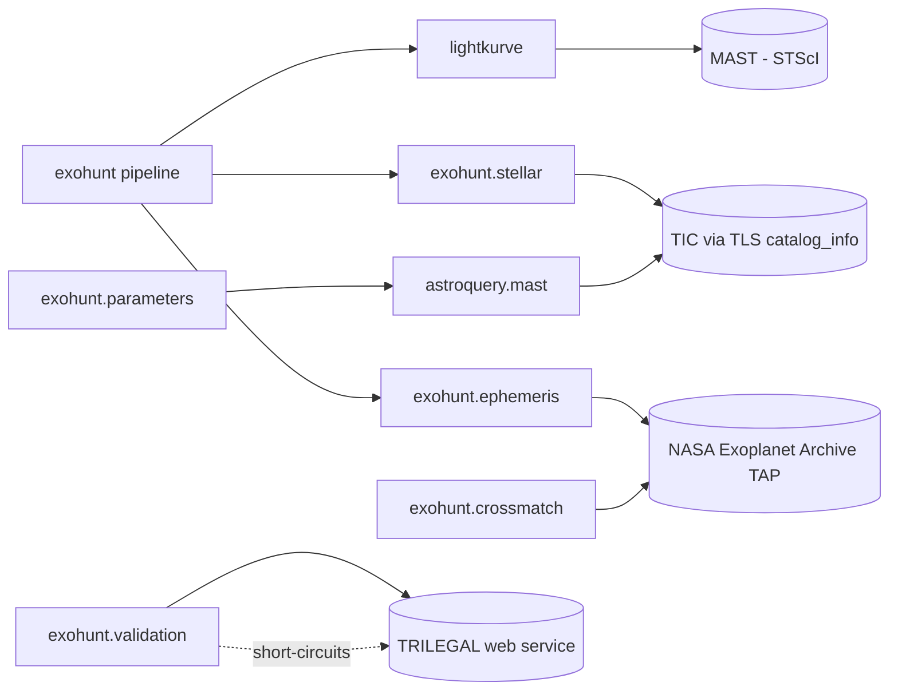

# Dependencies — Exohunt

All declared and implied dependencies, how they are used, and integration boundaries.

## Declared dependencies (`pyproject.toml`)

### Runtime (`[project] dependencies`)

| Package | Role in codebase |
|---|---|
| `numpy` | Numerical arrays throughout. Time/flux handling, masks, downsampling, metrics. Pervasive. |
| `matplotlib` | Static plots (prepared light curve, periodograms, phase-folds) via `exohunt.plotting`. |
| `astropy` | `astropy.timeseries.BoxLeastSquares` powers `exohunt.bls`. `astropy.time.Time` is used in tests. |
| `lightkurve` | `lk.search_lightcurve`, `lk.search_targetpixelfile`, `LightCurve`, `TargetPixelFile`. Main ingest and cache round-trip type. |
| `pandas` | Used indirectly by Lightkurve; also via version reporting in manifests (listed as a key in `_runtime_version_map`). No direct dataframe code in-package beyond versions. |
| `transitleastsquares` | TLS search backend (`exohunt.tls.run_tls_search`). Also provides `catalog_info` for stellar params (`exohunt.stellar`). |
| `triceratops` | Bayesian FPP / NFPP validation (`exohunt.validation`). Imports `triceratops.triceratops.target` and monkey-patches `triceratops.funcs.query_TRILEGAL`. |

### Optional extras

| Extra | Packages | Purpose |
|---|---|---|
| `plotting` | `plotly` | Interactive HTML plots (`save_raw_vs_prepared_plot_interactive`). Activated by `plot.interactive_html = true`. |
| `dev` | `ruff`, `pytest`, `pytest-cov`, `mypy`, `pre-commit` | Lint, test, type-check, pre-commit integration. |

### Build system

`requires = ["setuptools>=68", "wheel"]` with `setuptools.build_meta`. `src/` layout with packages discovered under `src/`. Package data includes `exohunt/presets/*.toml` so presets ship with the wheel.

## Implicit / opportunistic dependencies

These are not in `[project] dependencies` but are imported via try/except fallbacks or optional code paths. Installing them unlocks additional functionality.

| Package | Where used | Behavior if missing |
|---|---|---|
| `tomli` | `exohunt.config` (`try: import tomllib except ModuleNotFoundError: import tomli`) | Only needed on Python < 3.11. Python 3.10 standard lib lacks `tomllib`, so `tomli` is required at runtime on 3.10. Not declared in `pyproject.toml` — rely on transitive installs or add manually on 3.10 if missing. |
| `astroquery` | `exohunt.parameters._lookup_tic_density` (try/except `ImportError`) | Falls back to the configured default stellar density. Behind `parameters.tic_density_lookup = true`. |

> **Note:** On a clean Python 3.10 install, `tomllib` is not present; `exohunt.config` must fall back to `tomli`. `tomli` is commonly installed transitively (e.g. by `pytest`), which is why this works in practice and in CI, but pipelines outside the dev extras should either run Python 3.11+ or install `tomli` explicitly.

## External services (runtime HTTP / network)

| Service | Used by | Notes |
|---|---|---|
| MAST (TESS light curves, TPFs) | `lightkurve` inside `_ingest_stage` and `exohunt.centroid` | Accessed over HTTPS. Retried with exponential backoff (up to 3 attempts) on `OSError / ConnectionError / TimeoutError` in `run_batch_analysis`. |
| NASA Exoplanet Archive TAP (`https://exoplanetarchive.ipac.caltech.edu/TAP/sync`) | `exohunt.ephemeris`, `exohunt.crossmatch` | 3 retries with exponential backoff in `_tap_query`. Crossmatch rate-limits to 0.3s per TIC. |
| TIC via `transitleastsquares.catalog_info` | `exohunt.stellar` | Thread-pool timeout 30s. Falls back to solar defaults on any failure. |
| TIC via `astroquery.mast.Catalogs` | `exohunt.parameters` (optional) | Thread-pool timeout 10s. Only runs if `parameters.tic_density_lookup = true` and `astroquery` is installed. |
| TRILEGAL (via TRICERATOPS internals) | `exohunt.validation` | Deliberately short-circuited (`query_TRILEGAL` replaced with a no-op). If unavailable, the validator drops `DTP, DEB, DEBx2P, BTP, BEB, BEBx2P` scenarios. |

## Python standard library reliance

Heavy use of: `pathlib`, `dataclasses`, `json`, `csv`, `hashlib`, `logging`, `argparse`, `importlib.resources`, `importlib.metadata`, `platform`, `sys`, `typing`, `concurrent.futures`, `urllib.parse`, `urllib.request`, `time.perf_counter`, `datetime`, `copy.deepcopy`, `functools.lru_cache`, `multiprocessing`.

No third-party HTTP client (uses stdlib `urllib.request`) — this keeps the dependency footprint small for the TAP calls.

## File-system dependencies

- Default cache root: `outputs/cache/lightcurves/`. Created on first write.
- Default batch paths: `outputs/batch/run_state.json`, `outputs/batch/run_status.csv`, `outputs/batch/run_status.json`, `outputs/batch/candidates_live.csv`, `outputs/batch/candidates_novel.csv`.
- Default top-level aggregation outputs: `outputs/candidates_summary.json`, `outputs/candidates_crossmatched.json`.
- Default comparison report path: `outputs/reports/preprocessing-method-comparison.md`.
- Presets are loaded via `importlib.resources.files("exohunt.presets")` — they work from both source tree and installed wheel.

## Operating system / platform notes

- Tested on Python 3.10 and 3.11 (CI matrix in `.github/workflows/ci.yml`).
- macOS note: `exohunt.tls` forces multiprocessing start method to `fork` on POSIX to avoid TLS process-pool issues on macOS.
- `.docs/research_manual.md` recommends `nohup caffeinate -dims ...` for long macOS batch runs.

## Dev tooling dependencies

| Tool | Source | Usage |
|---|---|---|
| `ruff` | dev extra + pre-commit hook `v0.6.9` | Lint with `line-length=100`, `target-version="py310"`. |
| `ruff-format` | pre-commit hook | Code formatting. |
| `pytest` | dev extra | Test runner. `testpaths = ["tests"]`. |
| `pytest-cov` | dev extra | Coverage. Not wired into CI by default. |
| `mypy` | dev extra | Type-check (no config checked in; not part of CI). |
| `pre-commit` | dev extra | Local hook runner; not required for CI. |
| GitHub Actions | `actions/checkout@v4`, `actions/setup-python@v5` | CI matrix on 3.10 + 3.11. |

## Security / trust boundaries

- All network traffic goes to well-known public archives (MAST, NASA Exoplanet Archive). No writes back to external services.
- Cached `.npz` files and JSON manifests live entirely under the user's `outputs/` directory. The project does not ship a database or a server.
- TRICERATOPS's internal TRILEGAL call is intentionally replaced with a no-op at import time in `exohunt.validation` to avoid relying on a flaky third-party web service.
- No secrets, tokens, or credentials are used or required.

## Dependency risk / lifecycle considerations

- `tomllib` is stdlib on 3.11+; the 3.10 fallback path (`import tomli`) is a latent constraint — adding `tomli` explicitly to runtime deps (or bumping minimum Python to 3.11) would make this watertight.
- `transitleastsquares` and `triceratops` pin internal model choices (Claret limb-darkening tables, stellar population models) that can change with upstream releases. Manifests capture the installed versions in `versions` so reruns can be diffed against those upgrades.
- `lightkurve` is the primary data-access dependency; a breaking change to `search_lightcurve` or the on-disk `LightCurve` interface is the single largest exogenous risk.
