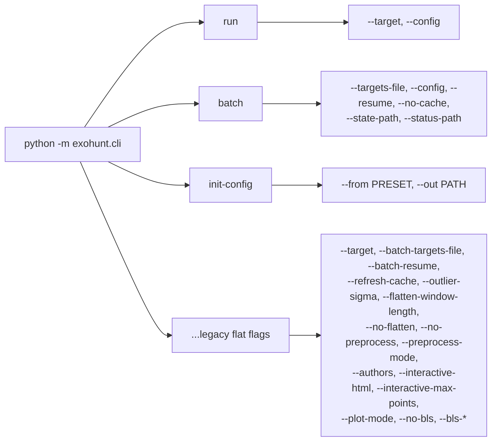

# Interfaces — Exohunt

All externally observable interfaces: the CLI surface, Python module APIs, configuration schema, on-disk artifact contracts, and external HTTP / data-source integrations.

## 1. CLI interfaces

### 1.1 `exohunt.cli` (new form)

Invocation: `python -m exohunt.cli <subcommand> [options]`.



**`run`** — analyze one target.

- `--target` (required): e.g. `"TIC 261136679"`.
- `--config` (default `science-default`): preset name (`quicklook` | `science-default` | `deep-search` | `iterative-search`) or a filesystem path to a TOML config.

**`batch`** — analyze many targets with resumable state.

- `--targets-file` (required): newline-delimited file; blank lines and `#`-comment lines are ignored.
- `--config` (default `science-default`): preset name or TOML path.
- `--resume`: skip targets already in `run_state.json` `completed_targets`.
- `--no-cache`: disable writing light curve cache (reads still allowed).
- `--state-path`: override batch state JSON location (default `outputs/batch/run_state.json`).
- `--status-path`: override batch status CSV location (default `outputs/batch/run_status.csv`).

**`init-config`** — export a preset to a TOML file.

- `--from` (required, choices from `list_builtin_presets()`).
- `--out` (required): destination path.

**Legacy form** — triggered when the first positional argument is not `run`/`batch`/`init-config`. Emits deprecation warning. Accepts the full flat-flag set (see `build_legacy_parser` in `cli.py`). Maps `--preprocess-mode global` → `stitched` with a warning.

### 1.2 Aggregation / reporting CLIs

```bash
python -m exohunt.collect     [--outputs-dir DIR] [--iterative-only] [--all] [-o OUT]
python -m exohunt.crossmatch  [SUMMARY_PATH] [-o OUT]
python -m exohunt.comparison  [--metrics-csv PATH] [--cache-dir DIR] [--report-path PATH]
```

Exit codes: `0` on success, non-zero on unhandled exception (raised as `SystemExit` from `main()`).

## 2. Python module APIs (what other code imports)

### 2.1 Pipeline entry points (`exohunt.pipeline`)

```python
def fetch_and_plot(
    target: str,
    *,
    cache_dir: Path | None = None,
    refresh_cache: bool = False,
    # Preprocess
    outlier_sigma: float = 5.0,
    flatten_window_length: int = 401,
    preprocess_enabled: bool = True,
    no_flatten: bool = False,
    preprocess_mode: str = "per-sector",   # stitched | per-sector (legacy: global → stitched)
    preprocess_iterative_flatten: bool = False,
    preprocess_transit_mask_padding_factor: float = 1.5,
    # Ingest
    authors: str | None = None,
    max_download_files: int | None = None,
    # Plot
    plot_enabled: bool = True,
    plot_mode: str = "stitched",
    interactive_html: bool = False,
    interactive_max_points: int = 200_000,
    plot_smoothing_window: int = 5,
    # Search
    run_bls: bool = True,
    bls_mode: str = "stitched",
    bls_search_method: str = "bls",         # bls | tls
    bls_period_min_days: float = 0.5,
    bls_period_max_days: float = 20.0,
    bls_duration_min_hours: float = 0.5,
    bls_duration_max_hours: float = 10.0,
    bls_n_periods: int = 2000,
    bls_n_durations: int = 12,
    bls_top_n: int = 5,
    bls_min_snr: float = 7.0,
    bls_compute_fap: bool = False,
    bls_fap_iterations: int = 1000,
    bls_iterative_masking: bool = False,
    bls_iterative_passes: int = 1,
    bls_iterative_top_n: int = 1,
    bls_transit_mask_padding_factor: float = 1.5,
    bls_subtraction_model: str = "box_mask",
    bls_unique_period_separation_fraction: float = 0.05,
    # Vetting
    vetting_min_transit_count: int = 2,
    vetting_odd_even_max_mismatch_fraction: float = 0.30,
    vetting_alias_tolerance_fraction: float = 0.02,
    vetting_secondary_eclipse_max_fraction: float = 0.30,
    vetting_depth_consistency_max_fraction: float = 0.50,
    # Parameters
    parameter_stellar_density_kg_m3: float = 1408.0,
    parameter_duration_ratio_min: float = 0.05,
    parameter_duration_ratio_max: float = 1.8,
    parameter_apply_limb_darkening_correction: bool = False,
    parameter_limb_darkening_u1: float = 0.4,
    parameter_limb_darkening_u2: float = 0.2,
    parameter_tic_density_lookup: bool = False,
    # Provenance
    config_schema_version: int = 1,
    config_preset_id: str | None = None,
    config_preset_version: int | None = None,
    config_preset_hash: str | None = None,
    # Ops
    no_cache: bool = False,
    triceratops_enabled: bool = False,
    triceratops_n: int = 100_000,
) -> Path | None: ...
```

Returns the path to the primary plot (or `None` if plotting disabled and no output path to surface). Raises `RuntimeError` on fatal errors (no TESS products, invalid modes, etc.).

```python
def run_batch_analysis(
    targets: list[str],
    *,
    # same search/preprocess/plot parameters as fetch_and_plot
    ...
    resume: bool = False,
    no_cache: bool = False,
    state_path: Path | None = None,
    status_path: Path | None = None,
) -> tuple[Path, Path, Path]:
    """Returns (state_path, status_csv_path, status_json_path)."""
```

### 2.2 Config API (`exohunt.config`)

```python
def resolve_runtime_config(
    config_path: Path | None = None,
    preset_name: str | None = None,
    cli_overrides: dict | None = None,
) -> RuntimeConfig: ...

def list_builtin_presets() -> tuple[str, ...]: ...
def get_builtin_preset_metadata(name: str) -> tuple[preset_id, pack_version, preset_hash]: ...
def write_preset_config(preset_name: str, out_path: Path) -> Path: ...

class ConfigValidationError(ValueError): ...
```

### 2.3 Search API

```python
# exohunt.bls
@dataclass(frozen=True)
class BLSCandidate: ...
def run_bls_search(lc_prepared, ..., min_snr=7.0, ...) -> list[BLSCandidate]: ...
def run_iterative_bls_search(lc_prepared, ...) -> list[BLSCandidate]: ...
def compute_bls_periodogram(lc_prepared, ...) -> tuple[ndarray, ndarray]: ...
def refine_bls_candidates(lc_prepared, candidates, ...) -> list[BLSCandidate]: ...

# exohunt.tls
def run_tls_search(lc_prepared, period_min_days, period_max_days, top_n, min_sde,
                   bin_minutes, unique_period_separation_fraction, stellar_params)
                   -> list[BLSCandidate]: ...

# exohunt.stellar
@dataclass(frozen=True)
class StellarParams: ...
def query_stellar_params(tic_id: int, timeout_seconds: float = 30.0) -> StellarParams: ...

# exohunt.ephemeris
@dataclass(frozen=True)
class KnownPlanetEphemeris: ...
def query_known_ephemerides(tic_id: int, timeout: float = 30.0) -> list[KnownPlanetEphemeris]: ...
def query_toi_ephemerides(tic_id: int, timeout: float = 30.0) -> list[KnownPlanetEphemeris]: ...
def query_all_ephemerides(tic_id: int, timeout: float = 15.0) -> list[KnownPlanetEphemeris]: ...
```

### 2.4 Vet / validate / parameter APIs

```python
# exohunt.vetting
@dataclass(frozen=True)
class CandidateVettingResult: ...
def vet_bls_candidates(lc_prepared, candidates, ...) -> dict[int, CandidateVettingResult]: ...

# exohunt.parameters
@dataclass(frozen=True)
class CandidateParameterEstimate: ...
def estimate_candidate_parameters(candidates, stellar_density_kg_m3=1408.0, ...)
    -> dict[int, CandidateParameterEstimate]: ...

# exohunt.validation
@dataclass(frozen=True)
class ValidationResult:  # fpp, nfpp, validated, status
def validate_candidate(tic_id, sectors, time, flux, flux_err, period_days, t0,
                       duration_hours, depth_ppm, N=1_000_000) -> ValidationResult: ...

# exohunt.centroid
@dataclass(frozen=True)
class CentroidResult: ...
def check_centroid_shift(tpf, period_days, transit_time, duration_hours,
                         max_shift_pixels=0.1) -> CentroidResult: ...
def run_centroid_vetting(tic_id, candidates, tpf=None, timeout_seconds=120.0)
    -> dict[int, CentroidResult]: ...
```

### 2.5 Preprocess / plot APIs

```python
# exohunt.preprocess
@dataclass(frozen=True)
class PreprocessingQualityMetrics: ...
def prepare_lightcurve(lc, outlier_sigma=5.0, flatten_window_length=401, apply_flatten=True,
                       max_transit_duration_hours=0.0, transit_mask=None) -> tuple[lk.LightCurve, bool]: ...
def compute_preprocessing_quality_metrics(lc_raw, lc_prepared) -> PreprocessingQualityMetrics: ...

# exohunt.plotting
def save_raw_vs_prepared_plot(target, lc_raw, lc_prepared, boundaries,
                              output_key="stitched", smoothing_window=5) -> Path: ...
def save_raw_vs_prepared_plot_interactive(...) -> Path: ...
def save_candidate_diagnostics(target, lc_prepared, candidates, ...) -> list[tuple[Path, Path]]: ...
```

### 2.6 Aggregation APIs

```python
# exohunt.collect
def collect_passed_candidates(outputs_dir=Path("outputs"), iterative_only=False,
                              passed_only=True) -> dict: ...
# exohunt.crossmatch
def crossmatch(summary_path: Path, output_path: Path | None = None) -> dict: ...
# exohunt.comparison
def build_preprocessing_comparison_report(metrics_csv_path, cache_dir, report_path) -> Path: ...
```

## 3. Configuration schema (TOML)

### 3.1 Top-level keys

| Key | Type | Values | Notes |
|---|---|---|---|
| `schema_version` | int | `1` | required constant |
| `preset` | string | `quicklook` / `science-default` / `deep-search` / `iterative-search` / `null` | provenance only |

### 3.2 Sections and fields

Full reference: `examples/config-example-full.toml`. Summary (defaults from `_DEFAULTS` in `config.py`):

**`[io]`** — `refresh_cache: bool = false`.

**`[ingest]`** — `authors: list[string] = ["SPOC"]` (normalized to uppercase internally).

**`[preprocess]`** — `enabled (bool=true)`, `mode ("stitched"|"per-sector"; legacy "global" → stitched)`, `outlier_sigma (float=5.0)`, `flatten_window_length (int=401)`, `flatten (bool=true)`, `iterative_flatten (bool=false)`, `transit_mask_padding_factor (float=1.5)`.

**`[plot]`** — `enabled (bool=true)`, `mode ("stitched"|"per-sector")`, `interactive_html (bool=false)`, `interactive_max_points (int=200000)`, `smoothing_window (int=5)`.

**`[bls]`** — `enabled (bool=true)`, `mode ("stitched"|"per-sector")`, `search_method ("bls"|"tls")`, `period_min_days (float=0.5)`, `period_max_days (float=20.0)`, `duration_min_hours (float=0.5)`, `duration_max_hours (float=10.0)`, `n_periods (int=2000)`, `n_durations (int=12)`, `top_n (int=5)`, `min_snr (float=7.0)`, `compute_fap (bool=false)`, `fap_iterations (int=1000)`, `iterative_masking (bool=false)`, `unique_period_separation_fraction (float=0.05)`, `iterative_passes (int=1)`, `subtraction_model ("box_mask" default)`, `iterative_top_n (int=1)`, `transit_mask_padding_factor (float=1.5)`.

**`[vetting]`** — `min_transit_count (int=2)`, `odd_even_max_mismatch_fraction (float=0.30)`, `alias_tolerance_fraction (float=0.02)`, `secondary_eclipse_max_fraction (float=0.30)`, `depth_consistency_max_fraction (float=0.50)`, `triceratops_enabled (bool=false)`, `triceratops_n (int=100000)`.

**`[parameters]`** — `stellar_density_kg_m3 (float=1408.0 ≈ solar)`, `duration_ratio_min (float=0.05)`, `duration_ratio_max (float=1.8)`, `apply_limb_darkening_correction (bool=false)`, `limb_darkening_u1 (float=0.4)`, `limb_darkening_u2 (float=0.2)`, `tic_density_lookup (bool=false)`.

### 3.3 Rejected / removed keys

Presence of any of the following raises `ConfigValidationError` with an actionable message:

- `ingest.sectors` — sector filtering removed; exohunt ingests all sectors.
- `plot.time_start_btjd`, `plot.time_end_btjd`, `plot.sectors` — use `plot.mode`.
- `cache_dir` — fixed internal cache paths.
- `max_download_files` — default workflow uses full ingest.

## 4. On-disk artifact contracts

### 4.1 Per-target directory

Path: `outputs/<slug>/` where `<slug> = _safe_target_name(target)` (alphanumerics kept, everything else → `_`, lowercased, trimmed).

```text
outputs/<slug>/
├── plots/
│   └── <slug>_prepared_<mode-key>.png           # PNG + optional .html
├── candidates/
│   ├── <slug>__bls_<run-hash>.json              # per-run candidate list (JSON)
│   └── <slug>__bls_<run-hash>.csv               # same, CSV
├── diagnostics/
│   ├── <slug>__bls_<run-hash>__candidate_<rank>_periodogram.png
│   └── <slug>__bls_<run-hash>__candidate_<rank>_phasefold.png
├── metrics/
│   ├── preprocessing_summary.csv
│   └── preprocessing_summary.json
└── manifests/
    └── <slug>__manifest_<manifest_run_key>.json
```

### 4.2 Top-level `outputs/`

- `outputs/cache/lightcurves/` — `.npz` caches (raw + prepared, stitched + per-segment, plus `segments/<slug>/manifest.json`).
- `outputs/metrics/preprocessing_summary.csv` — global append-only preprocessing metrics; columns from `_PREPROCESSING_SUMMARY_COLUMNS`.
- `outputs/manifests/run_manifest_index.csv` — global append-only index across all runs and targets (columns from `_MANIFEST_INDEX_COLUMNS`).
- `outputs/batch/run_state.json` — `{completed_targets, failed_targets, errors, updated_utc}` for `--resume`.
- `outputs/batch/run_status.csv` + sidecar `.json` — per-target status rows (columns from `_BATCH_STATUS_COLUMNS`).
- `outputs/batch/candidates_live.csv` — all candidates across the batch (append-mode).
- `outputs/batch/candidates_novel.csv` — candidates that did not match any known planet / TOI (append-mode).
- `outputs/candidates_summary.json` — produced by `exohunt.collect`.
- `outputs/candidates_crossmatched.json` — produced by `exohunt.crossmatch`.

### 4.3 Manifest JSON schema (per run)

```json
{
  "schema_version": 1,
  "target": "TIC 261136679",
  "run": {"run_started_utc": "...", "run_finished_utc": "...", "runtime_seconds": 12.5},
  "comparison": {
    "comparison_key": "<16hex>",
    "config_hash": "<16hex>",
    "data_fingerprint_hash": "<16hex>"
  },
  "config": { ... flat config payload passed to fetch_and_plot ... },
  "data_summary": {
    "data_source": "download|raw-cache|prepared-cache",
    "n_points_raw": ...,
    "n_points_prepared": ...,
    "time_min_btjd": ...,
    "time_max_btjd": ...
  },
  "artifacts": { ...paths to plots, candidates, diagnostics, metrics... },
  "versions": {"python": "...", "exohunt": "...", "numpy": "...", "astropy": "...",
               "lightkurve": "...", "matplotlib": "...", "pandas": "...", "plotly": "..."},
  "platform": {"python_executable": "...", "platform": "..."}
}
```

### 4.4 Candidate JSON schema

Produced by `_write_bls_candidates`. Top-level keys:

```json
{
  "metadata": {"target": "...", "run_utc": "...", "preprocess_mode": "...",
               "bls_mode": "...", "bls_top_n": 5, ...},
  "candidates": [
    {
      "rank": 1,
      "period_days": 1.5669,
      "duration_hours": 3.0,
      "depth": 4.398e-05,
      "depth_ppm": 43.98,
      "power": 3.05e-05,
      "transit_time": 1683.5,
      "transit_count_estimate": 22.0,
      "snr": 10.5,
      "fap": null,
      "iteration": 0,
      "radius_ratio_rp_over_rs": 0.0066,
      "radius_earth_radii_solar_assumption": 0.72,
      "duration_expected_hours_central_solar_density": 2.6,
      "duration_ratio_observed_to_expected": 1.15,
      "pass_duration_plausibility": true,
      "parameter_assumptions": "depth~(Rp/Rs)^2; no flux dilution; ...",
      "parameter_uncertainty_caveats": "Preliminary estimate only: ...",
      "pass_min_transit_count": true,
      "pass_odd_even_depth": false,
      "pass_alias_harmonic": true,
      "pass_secondary_eclipse": true,
      "pass_depth_consistency": true,
      "vetting_pass": false,
      "transit_count_observed": 22,
      "odd_depth_ppm": 30.0,
      "even_depth_ppm": 58.0,
      "odd_even_depth_mismatch_fraction": 0.48,
      "secondary_eclipse_depth_fraction": 0.05,
      "depth_consistency_fraction": 0.1,
      "alias_harmonic_with_rank": -1,
      "vetting_reasons": "odd_even_depth_mismatch",
      "odd_even_status": "fail"
    }
  ]
}
```

See `examples/output-example-candidates.json` for an illustrative file.

### 4.5 Batch status CSV

Columns: `run_utc`, `target`, `status`, `error`, `runtime_seconds`, `output_path`.

`status` values: `success`, `error`, `skipped_completed`.

## 5. External integrations

### 5.1 MAST (TESS data)

- `lightkurve.search_lightcurve(target, mission="TESS", author="SPOC", exptime=120)` + `.download_all()`.
- `lightkurve.search_targetpixelfile(...)` for optional centroid analysis.
- Network failures are classified as transient (`OSError`, `ConnectionError`, `TimeoutError`) and retried up to 3 times in `run_batch_analysis`.

### 5.2 NASA Exoplanet Archive TAP

- Endpoint: `https://exoplanetarchive.ipac.caltech.edu/TAP/sync?query=...&format=json`.
- Queried by `exohunt.ephemeris` (pre-masking) and `exohunt.crossmatch` (post-run labeling).
- Queries:
  - `ps` table (confirmed planets) via `where tic_id='TIC <id>' and default_flag=1`.
  - `toi` table via `where tid=<id>`.
- `_tap_query` performs up to 3 retries with exponential backoff.

### 5.3 TIC catalog

- Via `transitleastsquares.catalog_info(TIC_ID=...)` for stellar R, M, and Claret limb-darkening coefficients (`exohunt.stellar`).
- Via `astroquery.mast.Catalogs.query_object(..., catalog="TIC")` for stellar density in `exohunt.parameters` (optional, behind `tic_density_lookup = true`).
- Thread-pool timeouts isolate blocking calls.

### 5.4 TRICERATOPS / TRILEGAL

- `triceratops.triceratops.target` (`exohunt.validation`). Optional, disabled by default.
- `triceratops.funcs.query_TRILEGAL` is monkey-patched to a no-op and the affected background scenarios are dropped so failures never surface as exceptions.

### 5.5 Plotting backends

- Matplotlib (default, required).
- Plotly (optional, via `pip install -e .[plotting]`); enabled by `plot.interactive_html = true`.
