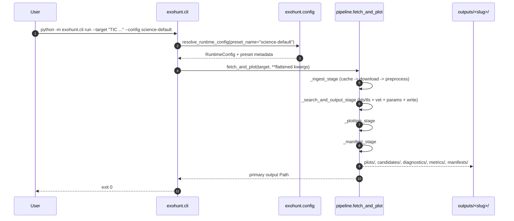
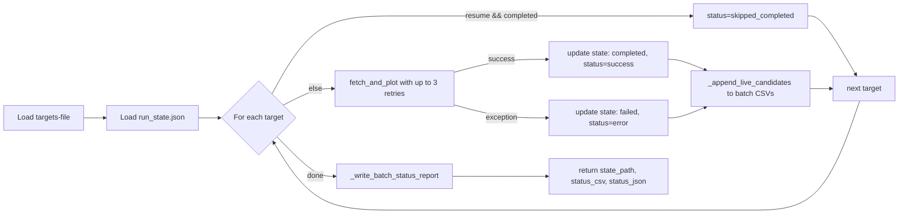
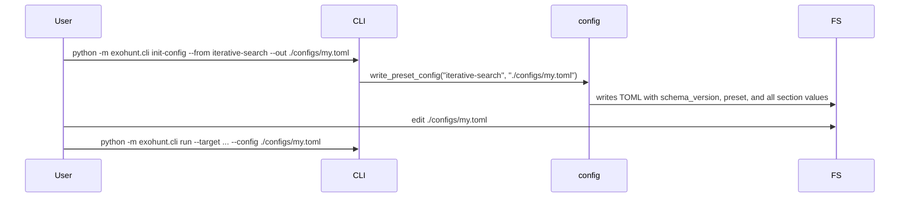
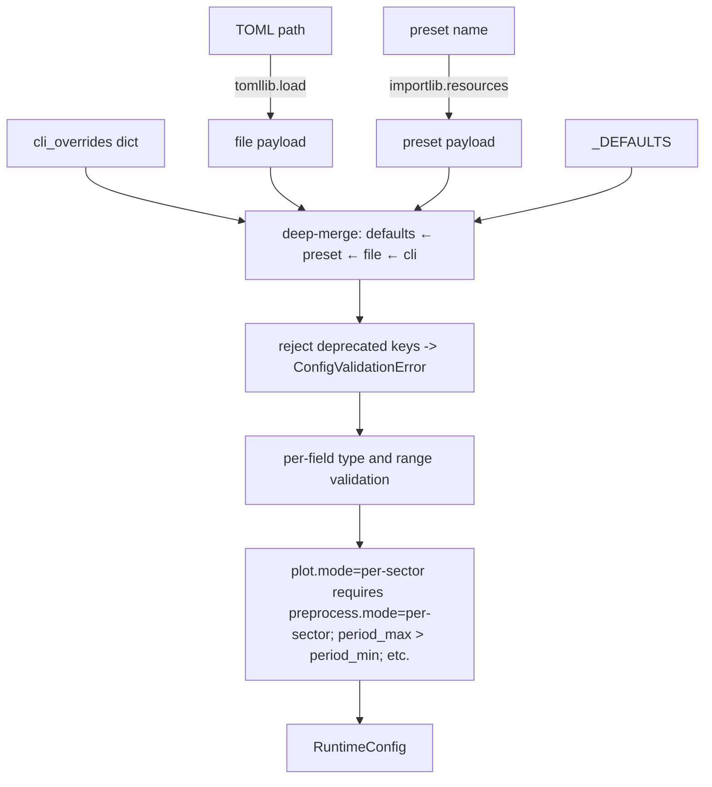
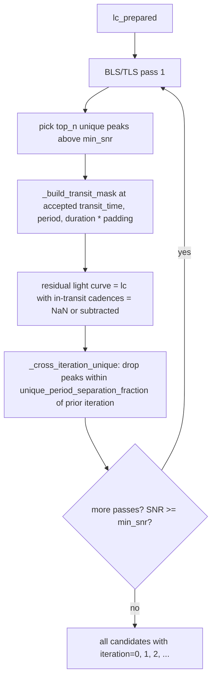
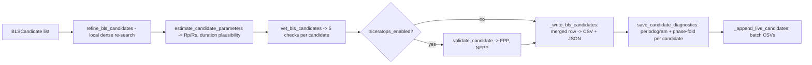
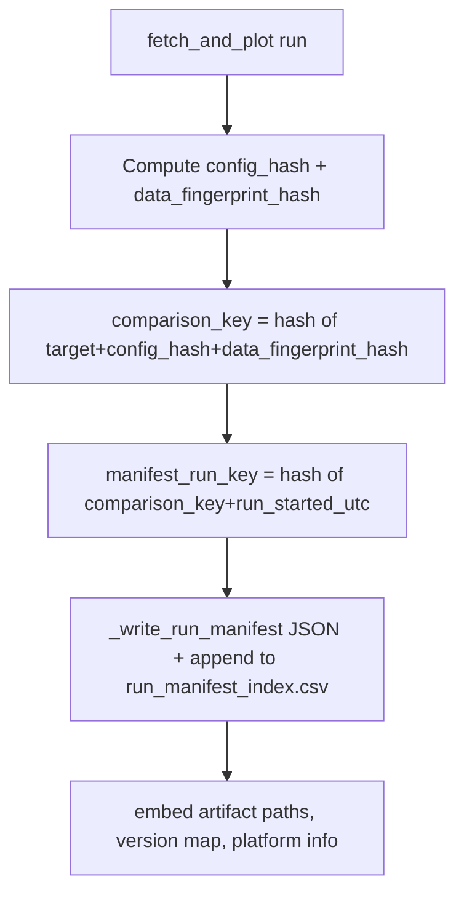
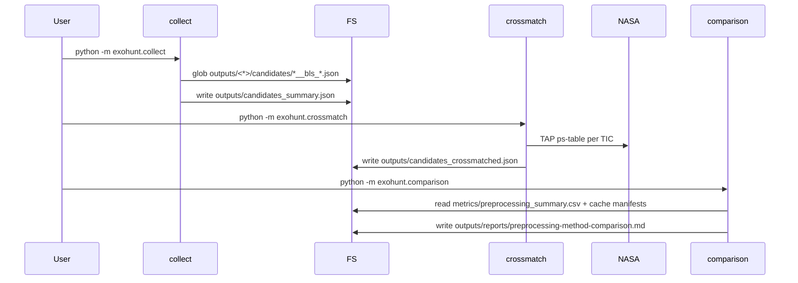

# Workflows — Exohunt

End-to-end workflows an operator or agent would actually run, and the internal control flow each triggers.

## 1. Single-target analysis (`cli run`)



### Decision points

- `--config` may be a preset name or a filesystem path. Resolution happens in `_resolve_config_reference`.
- Each of `preprocess.mode`, `plot.mode`, `bls.mode` is independently `"stitched" | "per-sector"`. Only `preprocess.mode` accepts the legacy `"global"` (remapped with warning).
- `bls.search_method = "bls"` uses `astropy` BLS; `"tls"` dispatches to `exohunt.tls.run_tls_search` with stellar-parameter pre-masking via `exohunt.ephemeris`.
- Iterative search is controlled by `bls.iterative_masking` and `bls.iterative_passes`. Each pass masks the transit epochs of accepted candidates before the next pass.

## 2. Batch systematic planet search (`cli batch`)



### Recommended workflow per `.docs/research_manual.md`

1. Start with a small, high-quality target list: `.docs/targets_premium.txt` (~200 targets, ~40h with iterative-search preset).
2. Run with `--resume --no-cache` and the `iterative-search` preset:
   ```bash
   python -m exohunt.cli batch \
     --targets-file .docs/targets_premium.txt \
     --config iterative-search \
     --resume --no-cache
   ```
3. Monitor `outputs/batch/candidates_novel.csv` live for candidates that did not match any known planet or TOI.
4. Collect across all targets: `python -m exohunt.collect`.
5. Cross-match against NASA Exoplanet Archive: `python -m exohunt.crossmatch`.
6. Expand to a larger target list with the same `--resume` (completed targets are skipped).
7. Optional: clean the light curve cache to reclaim disk space: `rm -rf outputs/cache/lightcurves`.

### macOS long-running-run convention (from research manual)

```bash
nohup caffeinate -dims python -m exohunt.cli batch \
  --targets-file .docs/targets_premium.txt \
  --config iterative-search \
  --resume --no-cache \
  > outputs/search_run.log 2>&1 &
```

## 3. Creating a custom config



### Config validation path



## 4. Iterative BLS / TLS transit search (inside a single run)



- `subtraction_model = "box_mask"` (default) simply NaNs in-transit cadences. Other strategies would substitute a model before re-searching (planned extension).
- Iteration index is written into each `BLSCandidate.iteration` and propagated into the per-candidate CSV/JSON row.
- `iterative_top_n` limits how many peaks per pass proceed into the next iteration's mask.

## 5. Candidate vetting and parameter estimation



The five vetting checks are all in `exohunt.vetting.vet_bls_candidates`:

1. `pass_min_transit_count` — observed integer epoch count >= `min_transit_count`.
2. `pass_odd_even_depth` — `|odd - even| / max(|odd|, |even|) <= odd_even_max_mismatch_fraction` when duty-cycle-adjusted expectation allows it, otherwise status is `inconclusive` (but still passes).
3. `pass_alias_harmonic` — does any higher-power candidate have a period whose simple ratio matches this one within `alias_tolerance_fraction`? If yes, fail.
4. `pass_secondary_eclipse` — depth at phase 0.5 as a fraction of primary depth <= `secondary_eclipse_max_fraction` (when computable).
5. `pass_depth_consistency` — fractional depth difference between first and second halves of data <= `depth_consistency_max_fraction`.

`vetting_pass = all five`. When `triceratops_enabled=true`, TRICERATOPS runs only on candidates that reach this point; its FPP/NFPP result is written alongside but does not gate `vetting_pass`.

## 6. Reproducibility workflow



Re-running with the same config and same cached data → same `comparison_key`. Different `manifest_run_key` per run (keyed by start timestamp), so individual runs are still distinguishable. Two runs with matching `comparison_key` can be diff'd directly to spot changes due to upstream library updates.

## 7. Post-run aggregation



- `collect` is read-only against candidate JSONs; it never re-runs analysis.
- `crossmatch` reads `candidates_summary.json` (or a custom path) and writes `candidates_crossmatched.json`. Rate-limited at 0.3s per TIC query.
- `comparison` groups runs by `cadence_class` × `sector_span_class` × `config_label` and ranks preprocessing configurations by a composite score (log of RMS / MAD / trend improvement, penalized for retention drops below 0.99).

## 8. Development workflow

```mermaid
flowchart LR
    Setup[python -m venv .venv && source .venv/bin/activate && pip install -e .[dev]] --> Edit[edit source]
    Edit --> Lint[ruff check .]
    Edit --> Test[pytest]
    Edit --> Hook[pre-commit run -a]
    Hook --> Commit[git commit]
    Commit --> CI[GitHub Actions: lint + test matrix 3.10, 3.11]
```

- Install dev extras: `pip install -e .[dev]` (adds `ruff`, `pytest`, `pytest-cov`, `mypy`, `pre-commit`).
- Optional plotting extras: `pip install -e .[plotting]` (Plotly).
- Pre-commit config uses `ruff` v0.6.9 with both `ruff` and `ruff-format` hooks.
- CI workflow: `.github/workflows/ci.yml` (`lint-and-test` job) installs the package with dev extras, runs `ruff check .`, then `pytest -q`.

## 9. Common ops recipes (from README / research manual)

```bash
# Quick look for a single target
python -m exohunt.cli run --target "TIC 261136679" --config quicklook

# Systematic batch search, deep mode, resumable
python -m exohunt.cli batch \
  --targets-file .docs/targets_iterative_search.txt \
  --config ./configs/iterative.toml \
  --resume --no-cache

# Aggregate and cross-match
python -m exohunt.collect
python -m exohunt.crossmatch

# Only collect candidates from iterative (iteration >= 1) passes
python -m exohunt.collect --iterative-only

# Include failed vetting too (exploratory)
python -m exohunt.collect --all

# Clean light curve cache to reclaim disk space (~1MB per target)
rm -rf outputs/cache/lightcurves
```

## 10. Failure / recovery playbook

| Symptom | Probable cause | Recovery |
|---|---|---|
| `ConfigValidationError: ... has been removed` | deprecated TOML key | Remove the key per the message; check `examples/config-example-full.toml`. |
| `RuntimeError: No TESS light curves found for target` | target has no SPOC 120s products | Try different authors or a different target; check in Lightkurve/ExoFOP. |
| `Invalid runtime configuration: ...` | schema or range violation | Inspect the failing field; defaults in `_DEFAULTS` are safe. |
| MAST / NASA archive timeouts | transient service issues | Relevant calls have retries with backoff; re-run the batch with `--resume`. |
| Batch hangs on a target | usually a MAST download | `kill` the process; re-run with `--resume`; the failed target will be retried. |
| `outputs/` grew very large | accumulated light curve cache (~1MB/target) | Run `rm -rf outputs/cache/lightcurves`. Analysis artifacts are untouched. |
| TRICERATOPS returns `error` status | TRILEGAL unavailable or insufficient points | Expected when `triceratops_enabled=false`. If enabled, inspect logs; background scenarios are auto-dropped when TRILEGAL fails. |
